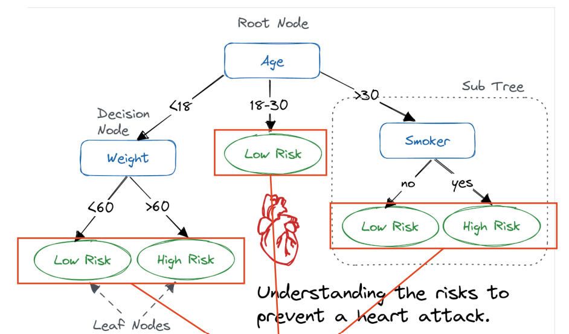

### Decision tree
> one sentence to conclude: predicting by starting from the root node and following a path of decision rules to the leaf node which provides the final output

Again, I would use a classic example to illustrate how it works.
{width=80%}
This is a simple decision tree which predicts the risk of heart disease. If there is a person who is age 31, program will enter the third sub tree and determine if this person is a smoker. If he is a smoker, the model will predict that he may have a high risk of heart disease.Unlike the linear regression, which uses loss function optimized by gradient decent, decision tree take a heuristic strategy to select criteria for each nodes.

Extension: GBDT & random forest
Decision tree may suffer from the overfitting(if the depth is large) and limited performance(limited the width and depth of the tree). 
**GBDT**
It uses a method called gradient boosting to build trees sequentially， which aims to reduce error from the previous one. Before building a tree, the error of previous tree is calculated. The new tree should be constructed to fit the error. The error is denoted as $r_i$ in the equation:
$$r_i=-\frac{\partial L(y_i,\hat{y}_i)}{\partial \hat{y}_i}$$ 
The error is actually the first-order derivative of the loss function.
Improved GBDT --> Xgboost

**random forest**
{width=70%}
This is a simple decision tree which predicts the risk of heart disease. If there is a person who is age 31, program will enter the third sub tree and determine if this person is a smoker. If he is a smoker, the model will claim that he may have a high risk of hear disease.
