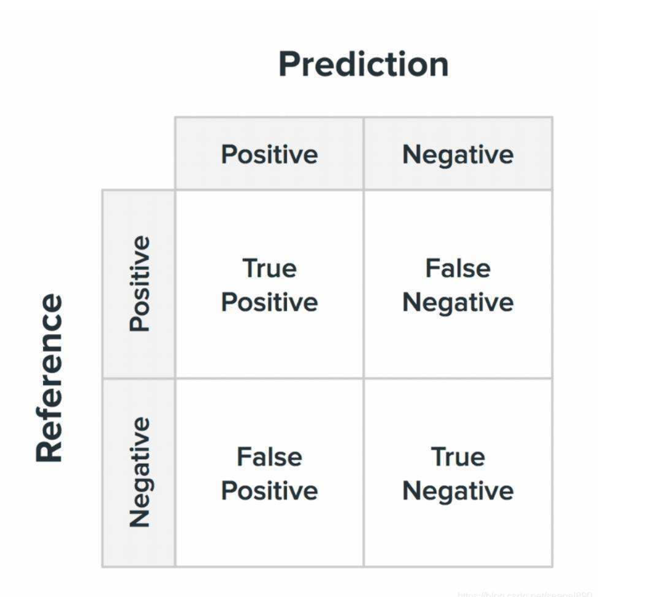
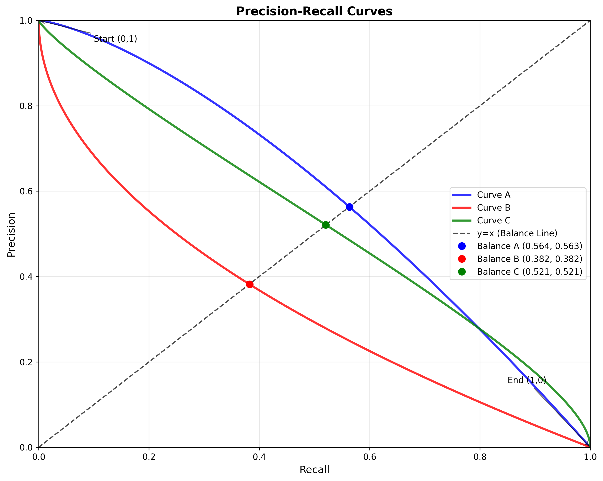
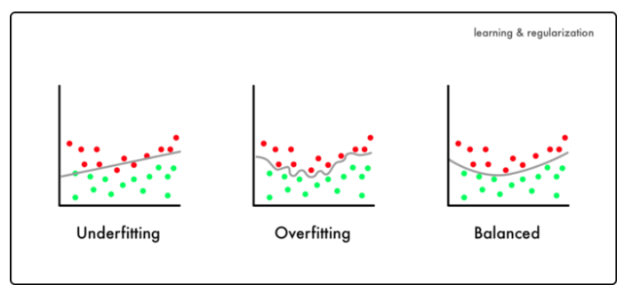

# Evaluating models
### Confusion metrics
In many blogs, we may see this metrics like the following picture.
{width=50%}
There are 4 elements consisting this metrics. To simplfy, I would use TP, FN, FP and TN in following article. Also, I would use some examples to illustrate the meanings of each element.
1. Ture positive
This represents the number of cases where the actual label is ture and our model predicts it as true. Take Covid as an example, we used to have a NAAT testing to determine if we were infected. TP means that we are infected and the test indicates positive.
2. False negative
This refers to the number of cases where the actual label is positive and our model predicts it as false. In the covid case, FN means we have already been infected but the test is negative.
3. False positive 
This refers to the number of cases where the actual label is false but our model thinks this is true. FP may indicates that we aren't infected but the test result is positive.
4. True negative
This represents the number of cases where the actual label is false and model predicts it as false. TN in the covid refers that we are not infected and the result is negative.

**Indicators**
As we understand the meanings of these elements, there are some methods to evaluate the model.
1. Precision
This indicator is always simplified as P. It refers how many results are predicted to be positive where the labels are positive.
$$ P=\frac{TP}{TP+FP} $$
2. Recall
It refers how many results are predicted to be positive for all the positive labeled samples.
$$ R=\frac{TP}{TP+FN} $$
Precision-Recall curve
Two elements could draw a curve enabling us to judge which model is better. For curve A and B in the following picture, B is enclosed by A and we can conclude A is a better model than B. But when we compare A to C, a part of curve C is beyond the curve A. If the curve is not fully enclosed by another one, it is hard to determine which one is greater. In this case, areas under the curves could be calculated and compared. But the F1-score seems to be a better choice. 

3. F1 score
This one combines precision and recall aiming to evaluate the model objectively and completely.
$$ F1=\frac{2*P*R}{P+R} $$
F1 score is the special case of Fβ score when the value of β is one.
$$ Fβ=\frac{(1+\beta^2)*P*R}{\beta^2*P+R} $$
In this formula, we can adjust the value of β to change the importance of P or R in current evaluation.
4. Interesting Relationship
For P and R, R grows while the value of P declines. If we want to increase the value of P, many restrict rules should be set to filter out actual negative samples. Simultaneously, some positive labelled samples would not be qualified which leads the value of FN increase. As the result, P increase but R decrease. The principle is similar when increasing the value of R. To make sure we choose as many positive labelled samples as possible. Many negative samples would be chosen due to the lower criteria. 
### Terms
For many of us, we always heard that XXX model could be overfitting or underfitting if we make some mistakes on the parameters. What does these terms mean? The following graph could fully illustrate this. If one model is under fitting, many of the samples would not be correctly predicted. The model is too simple to capture the pattern of the data resulting in high error on training and testing. As for an overfitting model, every single sample is well predicted. But it even learned every noise and abnormal samples. So, it have poor performance when predicting on new data. 
{width=80%}

