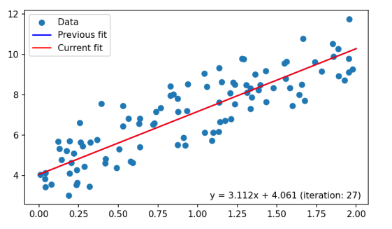

### Linear regression
> one sentence to conclude: a fit line which minimizes the sum of difference between predicted values and actual values.

There is a classic case when we talk about this method: for a house with certain square, how much we would pay for it.
{width=80%}
Linear regression creates a line with equation y=mx+c. To find the best fitting line, we would use a ruler in reality but how would the machine do this. First, we should know about the loss function.
The function calculates the difference between the $\hat{y}$ and y.(The predicted value is denoted as $\hat{y}$)
$$Loss(\hat{y},y)= \frac{1}{N}* \sum_{i=1}^{N} {(\hat{y}-y)^2}\tag{1}$$
$$m*,c*=\arg\min_{m,c} Loss(\hat{y},y)\tag{2}$$
The parameter is resolved by using the method called ordinary least square. 
If we increase the power of input variable, we will get a new regression called polynomial regression. Currently, this models the target variable y as a polynomial function of input variable x as:
$$ y=\sum_{i=0}^{N} \beta_{i}*x^i+\epsilon $$
